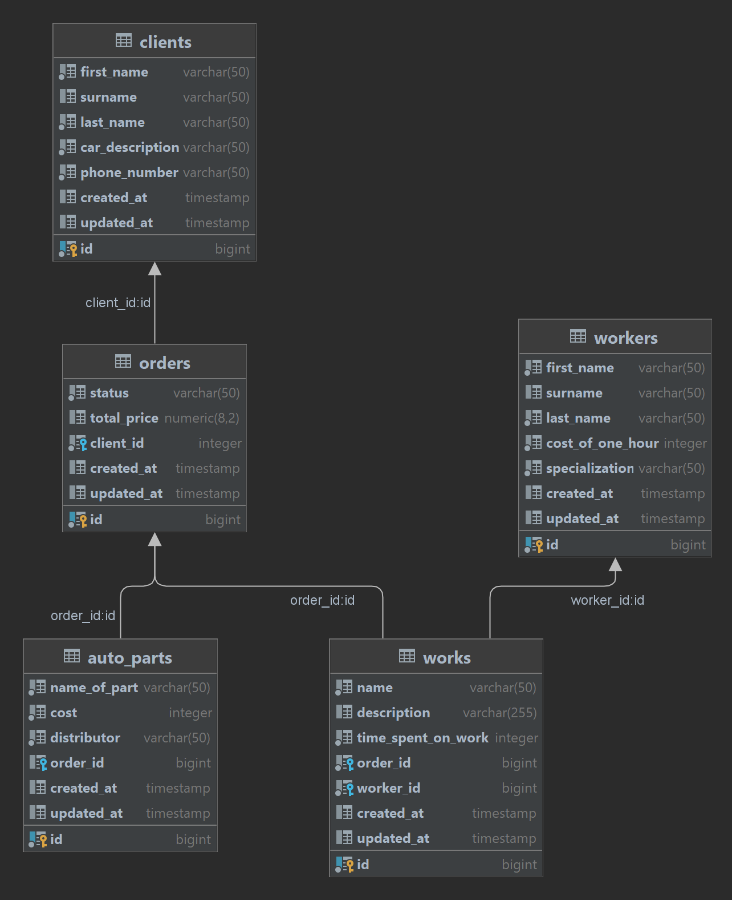

# **_Тестовое задание_**

Предметная область - мастерская по ремонту автомобилей.

В проекте были использованы следующие технологии:
- Spring framework (Spring Boot v3.1.1) - основной фреймворк использующийся в проекте;
- PostgreSQL - в качестве основной базы данных для хранения информации;
- Flyway - для поддержания целостности базы данных и контролем изменений;
- Maven - в качестве сборщика проектов;
- Swagger - используется для создания интерактивной документации.

### **_Запуск проекта._**

**Требования для работы проекта:**

- Docker;
- Java 17 или выше;
- Git;

**Порядок действий:**

- git clone https://github.com/Kingl88/test_task.git;
- cd test_task;
- .\mvnw.cmd clean package;
- java -jar core\target\core-0.0.1-SNAPSHOT.jar.

После запуска сервиса при переходе по ссылке http://localhost:8081/swagger-ui/index.html можно ознакомиться с документацией сконфигурированной **_Swagger_**.
